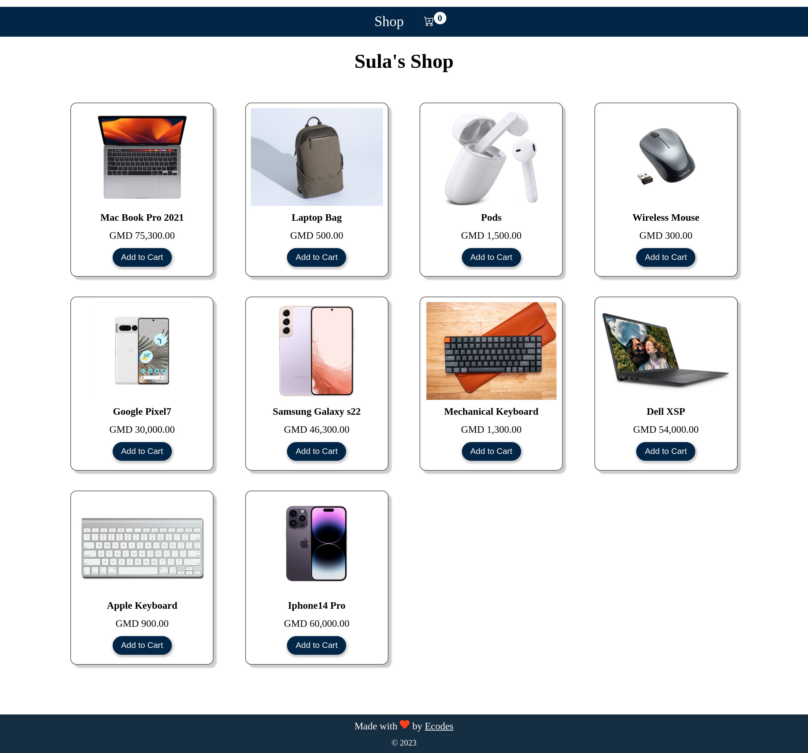
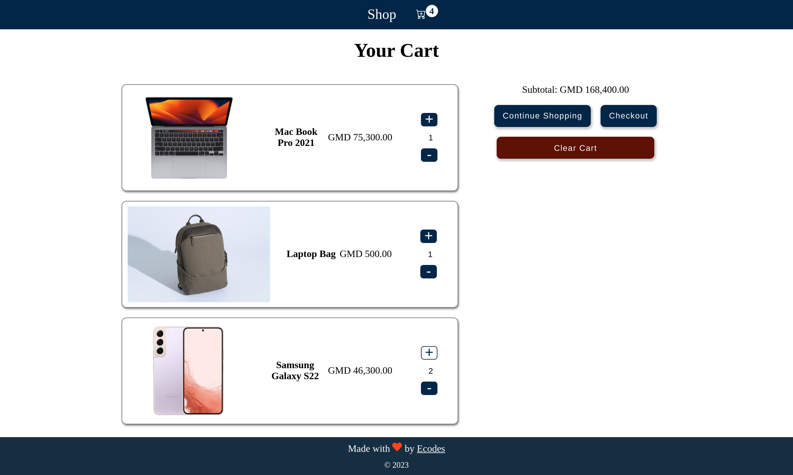

# Shopping Card

Shopping card with few items on the store.

## Store

The store display items(image, name, price, add button). The add button adds item on the card, one click will place the the current item to card(which is display on the add button), and from once click every other click item will add the item on the card.

## Card

The card only displays the item which are the added on the card. Card has more feature than the store:

### Updating Item Count

Each and every item on the card can be increase and decrease.

##### Increase Item Count

Plus button will increase item count on the card 

##### Decrease Item Count

Plus button will decrease item count on the card. When the item count is zero it will be automatically remove from the card.

The card has other button:

* Continue Shopping button will take you to the store
* Checkout button is not active yet
* Clear button will remove all the item on the card

The Subtotal will give track of all the items on the card and calculate their price

Preview:

Desktop

It is responsive
